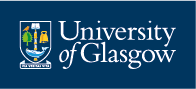

I am a postgraduate student in the University of [Glasgow’s Institute of Neuroscience and Psychology](https://www.gla.ac.uk/researchinstitutes/neurosciencepsychology/). I work with [Dr Monika Harvey](https://www.gla.ac.uk/schools/psychology/staff/monikaharvey/), [Prof Gregor Thut](https://www.gla.ac.uk/researchinstitutes/neurosciencepsychology/staff/gregorthut/) and [Dr Gemma Learmonth](https://gemmalearmonth.com/).

Table of content

I am a researcher interested in how non-invasive neurocognitive tools such as neurofeedback can be used to improve fatigue and attentional deficits in stroke patients.

# Experience

* Title: University of Glasgow

** Psychology
** Dissertation: Investigation of alpha rhythms during phasic alerting in young and older adults
** Honours courses: Cognitive Psychology, Human Development, Perception Vision Cognition, Professional Skills, Social Psychology, Statistics, Individual Differences, Qualitative Mini Project, Quantitative Mini Project, Physiological Psychology, Psychometrics, Virtue Ethics, Cognitive Neuroscience: Insights into Brain Plasticity, Neuropsychological Deficits, Sleep and Circadian Timing, Neuroscience of Decision Making, From Visual Awareness to Free Will, Current Trends in Clinical Psychology, Health Neuroscience.

* Title: Research Scientist, Summer Intern
** Employment: Full-time
** Dates Employed: Jun 2018 – Jul 2018
** Employment Duration: 2 mos

** Optimising music listening interventions for individuals with neurological conditions.

# Volunteering

# Licences and Certifications

# Volunteer Experience

# Skills

# Accomplishments

## Languages

* Czech
* English
* German
* Polish

## Awards

## Publications

# CV Advantages

[experience](experience.html)