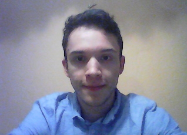

***

# Hello, welcome to my website!

***

I am a postgraduate student at the University of [Glasgow’s Institute of Neuroscience and Psychology](https://www.gla.ac.uk/researchinstitutes/neurosciencepsychology/). I work with [Dr Monika Harvey](https://www.gla.ac.uk/schools/psychology/staff/monikaharvey/), [Prof Gregor Thut](https://www.gla.ac.uk/researchinstitutes/neurosciencepsychology/staff/gregorthut/) and [Dr Gemma Learmonth](https://gemmalearmonth.com/).

My main topic of interest is attention and its role in various neurological disorders. Previously, I studied emotion and music-evoked autobiographical memories through public engagement. Insights from the project provide an improvement to the guidelines in therapeutic interventions for patients with a range of neurocognitive disorders. I am currently interested in the use of non-invasive electroencephalography (EEG) in neurofeedback therapy to relieve post-stroke fatigue and improve attention in stroke patients. 