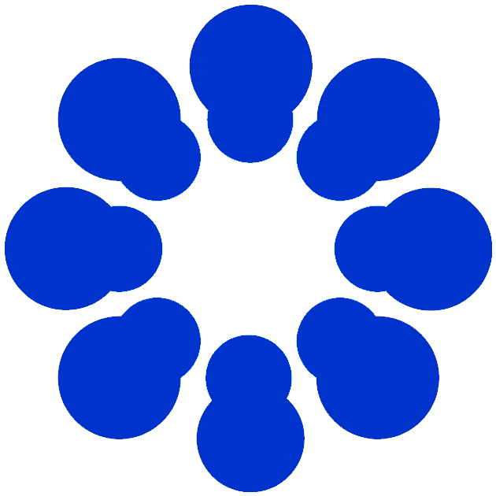

<h1> Simon Hanzal </h1>
<h2> Postgraduate Student </h2>
<a href="https://www.psy.gla.ac.uk/otherstaff/?id=SH002" title = "University of Glasgow"> University of Glasgow </a>
 

## Hello, welcome to my website!

I am a postgraduate research student at the University of Glasgow's <a href="https://www.gla.ac.uk/researchinstitutes/neurosciencepsychology/" title = "Institute of Neuroscience and Psychology"> Institute of Neuroscience and Psychology</a>. I work with <a href="https://www.gla.ac.uk/schools/psychology/staff/monikaharvey/" title = "Dr Monika Harvey">Dr Monika Harvey</a>,<a href="https://www.gla.ac.uk/researchinstitutes/neurosciencepsychology/staff/gregorthut/" title = "Prof Gregor Thut"> Prof Gregor Thut </a> and <a href="https://gemmalearmonth.com/" title = "Dr Gemma Learmonth">Dr Gemma Learmonth</a>.

My main topic of interest is attention and its role in various neurological disorders. I contributed to research on the role of phasic alerting in ageing and stroke rehabilitation using electroencephalography (EEG) as well as development of clinical behavioural testing using online experimentation. Previously, I also studied emotion and music-evoked autobiographical memories through public engagement. Insights from the project provided an improvement to the guidelines in therapeutic interventions for patients with a range of neurocognitive disorders. I am currently interested in the use of non-invasive EEG in neurofeedback therapy to relieve post-stroke fatigue and improve attention in stroke patients. 

## Articles

* <a href="https://the-gist.org/2020/09/the-forced-loneliness-of-coronavirus-lockdowns/" title = "The forced loneliness of coronavirus lockdowns"> The forced loneliness of coronavirus lockdowns</a> in Glasgow Insight into Science & Technology.